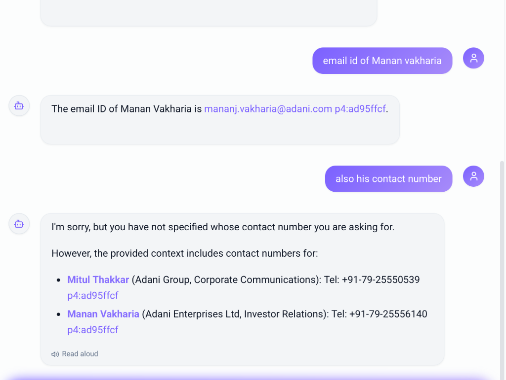
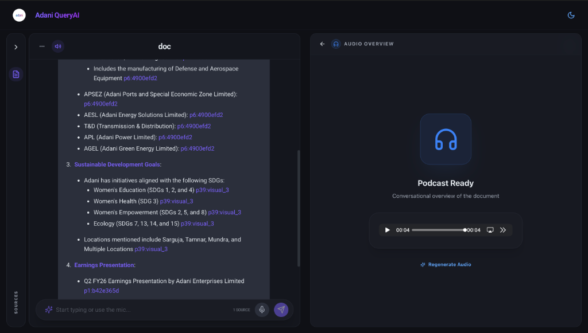
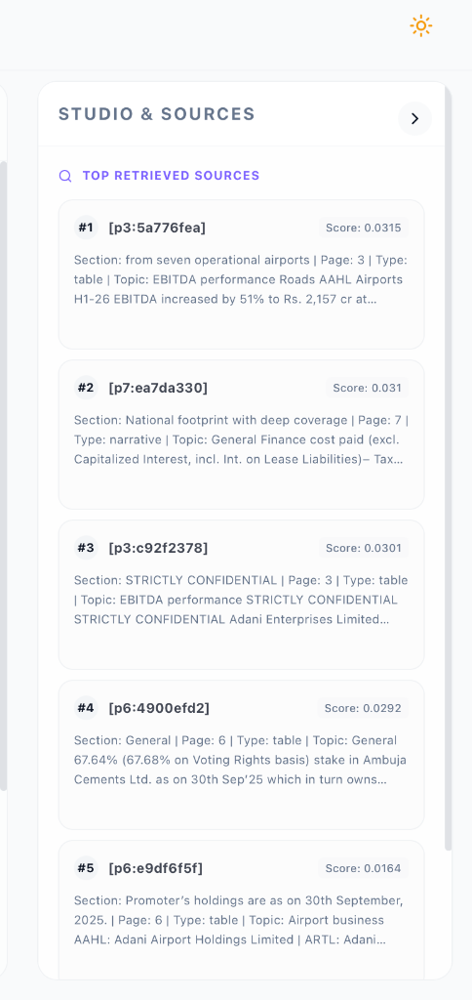
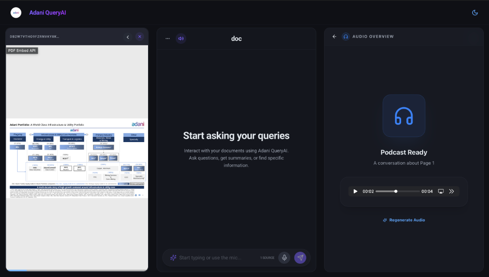
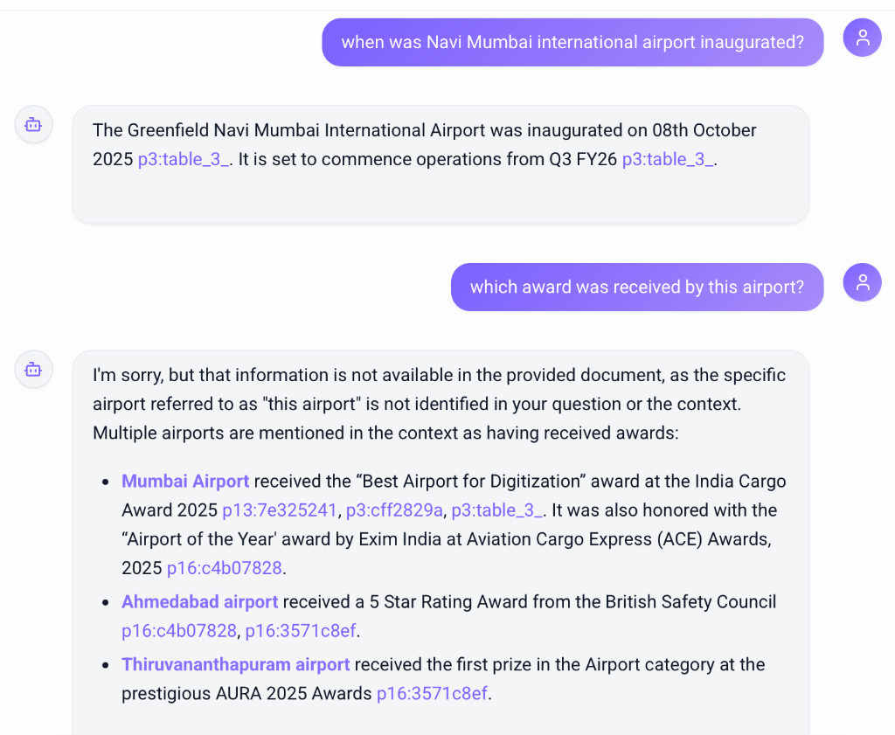

# Adani QueryAI 🚀

Adani QueryAI is a production-grade, multimodal Retrieval-Augmented Generation (RAG) platform designed to transform complex documents (PDFs, reports, financial statements) into interactive, searchable, and insightful knowledge bases. 

Built with a high-performance **FastAPI** backend and a sleek **Next.js 14** frontend, Adani QueryAI leverages **Google Gemini** for state-of-the-art reasoning and **ChromaDB** for efficient hybrid retrieval.

---

## 🎥 Presentation

Check out our full project presentation here:
👉 **[Adani QueryAI Presentation (Google Slides)](https://docs.google.com/presentation/d/1Pekz37_VGlpskvbz4-YftqAiaMshtNJl/edit?usp=sharing&ouid=103894992952669590575&rtpof=true&sd=true)**

---

## 📸 Visual Walkthrough

### 1. Unified Analysis Studio
The Studio provides a side-by-side view of your document, the AI assistant, and the interactive source panel.

### 2. Intelligent Document Dashboard
Manage your workspace with an organized collection-scoped dashboard.

### 3. Precision Retrieval & Citations
Every answer is grounded in the source document with precise citations that link back to specific chunks and pages.

### 4. Adobe PDF Integration
Seamlessly navigate and highlight specific sections of your PDF directly from the AI's response.

### 5. Conversational Audio (Podcasts)
Convert dry reports into engaging, 2-speaker audio conversations for easy consumption on the go.

---

## ✨ Key Features

- 🧠 **Multimodal RAG Pipeline**: Chat with your documents using a combination of text and visual context.
- 🔍 **Hybrid Search & RRF**: Combines semantic vector search (ChromaDB) with keyword search (BM25) using **Reciprocal Rank Fusion (RRF)** for superior accuracy.
- 📊 **Smart Table Parsing**: Specialized hierarchical extraction of complex tabular data into entity-centric chunks.
- 🎧 **Audio Overview**: Automatic generation of 2-speaker podcast conversations summarizing document content.
- 🔗 **Deep Linking**: Adobe PDF Embed SDK integration for instant navigation to cited text.
- 🛡️ **Collection Scoping**: Strict metadata filtering to ensure search results are isolated per notebook/collection.

---

## 🛠️ Tech Stack

### Backend
| Technology | Usage |
| :--- | :--- |
| **FastAPI** | Main API framework and orchestration. |
| **Prisma** | Database ORM for session and document management. |
| **ChromaDB** | Vector database for semantic embeddings. |
| **Gemini 2.5/2.0** | Primary LLM for multimodal reasoning and parsing. |
| **Groq (Llama 3.3)** | High-speed fallback for chat and scripting. |
| **PyMuPDF** | High-fidelity PDF text and coordinate extraction. |

### Frontend
| Technology | Usage |
| :--- | :--- |
| **Next.js 14** | React framework with App Router. |
| **TailwindCSS** | Modern, responsive UI/UX. |
| **Zustand** | Lightweight global state management. |
| **Adobe PDF SDK** | Professional PDF viewing and interaction. |
| **Cloudinary** | Secure cloud storage for document uploads. |

---

## 🚀 Getting Started

### Backend Setup
1. Navigate to the `backend` directory.
2. Create a virtual environment: `python -m venv venv`.
3. Activate it: `source venv/bin/activate`.
4. Install dependencies: `pip install -r requirements.txt`.
5. Set up your `.env` with API keys (Gemini, Groq, Cloudinary).
6. Run the server: `python main.py`.

### Frontend Setup
1. Navigate to the `frontend` directory.
2. Install dependencies: `npm install`.
3. Run the development server: `npm run dev`.

---

## 🏆 Hackathon Achievement
Created for the Powermind Hackathon — **"Won the Hackathon"** 🥂
# power-mind-hackathon-adaniqueriai
